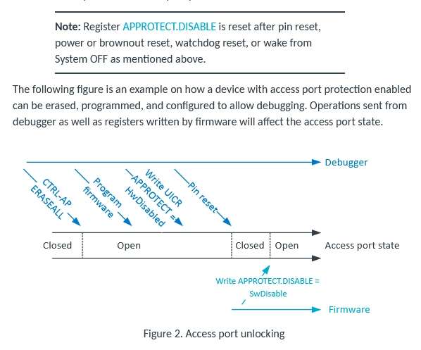

# nRF52840 APPROTECT Bypass — Voltage Glitch (Raiden Pico)

Bypass the Nordic nRF52840 **APPROTECT** (debug readback protection) by power-glitching
the core regulator during early boot so the AHB-AP stays enabled, then dump flash over SWD.

- **Technique:** LimitedResults "nRF52 Debug Resurrection / APPROTECT bypass"
- **Reference impl:** atc1441/ESP32_nRF52_SWD (ported to raiden-pico's SWD + crowbar engine)
- **Target:** bare nRF52840 module (MDBT50Q / Ebyte style)
- **Injection point:** the module **DEC1** pin (~1.3 V core regulator output) — **NOT** main VDD



## Wiring

| Raiden Pico (RP2350) | → | nRF52840 module |
|---|---|---|
| **GP17** | SWCLK | SWDCLK |
| **GP18** | SWDIO | SWDIO |
| **GP10** (target power ctrl) | power switch | module **VDD** (so the Pico can power-cycle it) |
| **GP2** (glitch out, idle LOW) | → 100 Ω → MOSFET gate | — |
| **GND** | common | module GND, PSU −, MOSFET source, scope GND |

Crowbar MOSFET (logic-level N-ch, e.g. IRLZ44N):

```
                 nRF52840 DEC1  (~1.3 V core rail)
                      │
                  [series R 1–10 Ω optional]
                      │
                      D
  GP2 ──[100 Ω]──G──[MOSFET]
                      │ \
                      │  └─[10 kΩ]── GND   (gate pull-down: MOSFET off at idle)
                      S
                      │
                     GND  ─── common
```

Scope (recommended for finding the window): trigger on **GP22** (`GLITCH_FIRED`, pulses each
shot); probe DEC1 to see the collapse, and GP2 to see the gate pulse.
**Tip (from atc1441): removing the DEC1/DEC-area decoupling caps on the module gives far better
glitch results.**

Notes:
- The Pico powers the nRF through GP10 so the glitch loop can power-cycle it. Use a
  **current-limited bench PSU (~100 mA)** feeding the rail; GP10 gates/cycles it.
- VDD must be a level the Pico GPIO/MOSFET path can switch; if the module needs 3.3 V and
  GP10 can't source it directly, use GP10 to drive a high-side switch / second MOSFET.

## Firmware commands

```
TARGET NRF52840                 # select nRF mode (inits SWD on GP17/GP18)
TARGET NRF STATUS               # quick: DPIDR + APPROTECT (PROTECTED/UNPROTECTED)
TARGET NRF INFO                 # full: DPIDR, lock state, FICR part/variant/pkg, flash size, UICR
TARGET NRF DUMP [addr] [bytes]  # hex dump over AHB-AP (needs UNPROTECTED); default 0x0, 256 B
TARGET NRF RESET                # CTRL-AP soft reset

TARGET GLITCH APPROTECT [d_start d_end d_step] [w_start w_end w_step] [off settle tries]
```

`TARGET GLITCH APPROTECT` runs a **2D sweep (delay × width)**. All params positional/optional:

| Param | Default | Meaning |
|---|---|---|
| d_start | 1000 | glitch delay after power-on, **µs**, start of delay sweep (outer) |
| d_end | 20000 | glitch delay, µs, end of delay sweep |
| d_step | 25 | delay increment, µs |
| w_start | 150 | crowbar width, **6.67 ns cycles**, start (≈1 µs) — inner sweep |
| w_end | 450 | crowbar width, cycles, end (≈3 µs). **Hard-clamped to 450.** ⚠️ |
| w_step | 75 | width increment, cycles (150→450 / 75 = 5 widths) |
| off | 60 | target off-time per power cycle, ms |
| settle | 8 | wait after glitch before SWD probe, ms |
| tries | *grid* | total attempts; **omit → one full grid pass** (n_delays × n_widths) |

Width is swept **inner**, delay **outer**: each delay is tried across all widths
(150, 225, 300, 375, 450 by default) before the delay advances. Per attempt the firmware:
SWD→hi-Z, power OFF `off` ms, power ON, wait the current delay µs, pulse GP2 for the current
width, wait `settle` ms, then SWD-connect and read CTRL-AP APPROTECTSTATUS. Success = DPIDR
`0x2BA01477` **and** APPROTECTSTATUS bit0 set (unprotected); it prints chip info and stops with
SWD left connected. The width sweep is clamped to the safe 150–450 cycle band.

## Workflow

```
TARGET NRF52840
TARGET NRF STATUS            # confirm DPIDR=0x2BA01477, expect PROTECTED on a locked part
TARGET GLITCH APPROTECT      # run the sweep (defaults); watch for "*** UNLOCKED ***"
TARGET NRF INFO              # confirm part/variant + flash size
TARGET NRF DUMP 0x0 4096     # read flash
```

Host-side, `scripts/nrf_attack.py` (single window) and `nrf_autopwn.py` (unattended) verify the
part is LOCKED, glitch, then on unlock auto-`INFO` + dump the full flash + RAM. For a quick manual
SWD-pipeline check on an already-open part (e.g. a factory-unlocked PCA10059 dongle), the firmware
`TARGET NRF STATUS | INFO | DUMP` commands above read it out directly.

PCA10059 SWD: `SWDIO`/`SWDCLK` are the gold castellations flanking the USB edge; power the
chip via the red `VDD` pad (USB unplugged). Factory dongles are debug-unlocked, so `validate`
should dump without any glitch; a `PROTECTED` result means glitch first.

Tuning: if no unlock, first **scope DEC1** to time the boot window and narrow `d_start..d_end`
around it, then sweep `width` within the **safe band 150–450 cycles (≈1–3 µs)**. Fewer
decoupling caps → wider success band.

> ⚠️ **Do not exceed ~3 µs (450 cycles).** A glitch that is too long can push the boot into a
> **mass-erase (NVMC ERASEALL)** instead of an APPROTECT-readback fault, wiping the flash you
> want to dump. The firmware hard-clamps width to 450 cycles and warns; stay 1–3 µs.

## Scope-assisted window finding (LAN)

On the PCA10059 dongle **DEC1 is not reachable** (only the removed-cap pad, which reads dead),
so the boot/APPROTECT window is timed with a flashed **boot marker**, not by watching DEC1
collapse. Use `scripts/nrf_timing_marker.py`:
- `marktime` / `measure` — power-on → app-start (the APPROTECT read precedes app-start),
- `resetmeasure` — nRST-release → app-start (warm boot),
- `crashmap` / `resetcrashmap` — sweep the delay and score boot survival to bracket the window.

For a live view during an attack, run `scripts/rigol_scope_live.py` in parallel (CH1=GP2 glitch
trigger, CH2=marker; LAN-only, no serial contention).

Firmware primitives: `TARGET NRF SHOT [delay_us] [width_cyc]` (power-cycle + single fire, no SWD
probe, GP22 pulses for the scope); `SHOTRST` is the nRST equivalent.

> Validated window for THIS rig (PCA10059): cold power-cycle, **delay ~1065–1170 µs, width
> ~225–265 cyc, off 18 ms** — see [`NRF52840_WIRING_POWERCYCLE.md`](NRF52840_WIRING_POWERCYCLE.md)
> / [`NRF52840_GLITCH_SETUP.md`](NRF52840_GLITCH_SETUP.md).

## Key register map (used by the firmware)

- DPIDR (nRF52): `0x2BA01477`
- CTRL-AP (AP **1**): RESET `0x00`, ERASEALL `0x04`, ERASEALLSTATUS `0x08`,
  **APPROTECTSTATUS `0x0C`** (bit0=1 → unprotected), IDR `0xFC`
- FICR (via AHB-AP): INFO.PART `0x10000100`, VARIANT `0x10000104`, PACKAGE `0x10000108`,
  CODEPAGESIZE `0x10000010`, CODESIZE `0x10000014`
- UICR.APPROTECT `0x10001208` (`0xFFFFFFFF` = unprotected)
