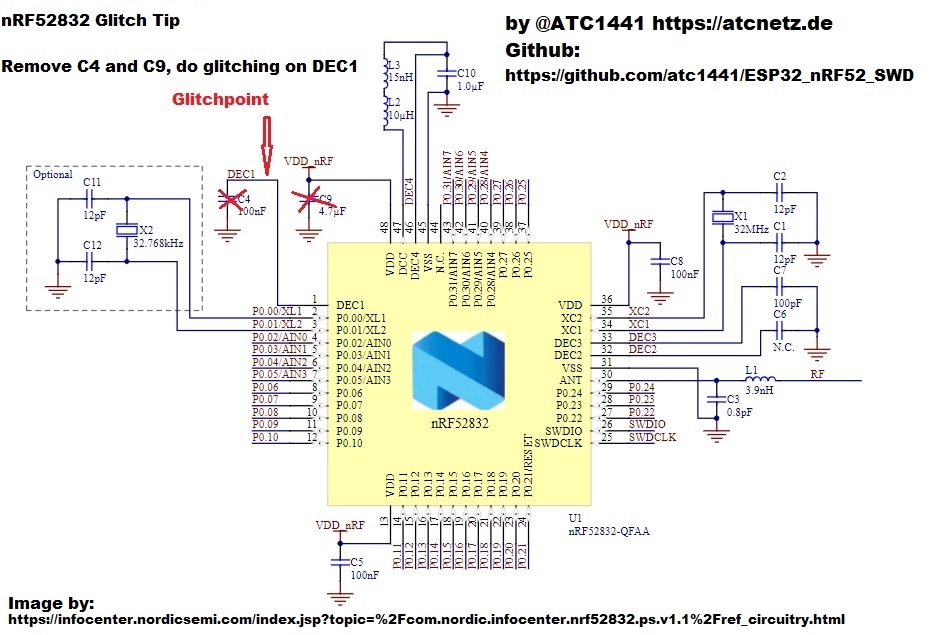

# nRF52840 APPROTECT Glitch — Bench Setup (probes, resistors, wiring)

Single source of truth for the physical rig. Target = **nRF52840 (PCA10059 dongle, rev 2)**,
glitcher = **Raiden Pico (RP2350)** on `/dev/ttyACM0`, scope = **Rigol DS2302A @ 10.0.0.10** (LAN/lxi).

Technique = **crowbar the DEC1 core rail to GND** during early boot (LimitedResults / atc1441),
NOT a VDD brownout. Injecting on DEC1 (~1.3 V core LDO output) faults the core directly.

```
                              nRF52840 (PCA10059)
   Raiden Pico (RP2350)                                   ┌──────────────┐
   ┌───────────────┐                                      │              │
   │ GP17  SWCLK ───┼──────────────────────────────────►  │ SWDCLK       │
   │ GP18  SWDIO ───┼◄─────────────────────────────────►  │ SWDIO        │
   │ GP10  PWR   ───┼──────────────────────────────────►  │ VDD (red pad)│  ◄ Pico powers+cycles target
   │ GND         ───┼───────────────────────────┬───────► │ GND          │
   │               │                            │         │ DEC1 (1.3V)  │  ◄ CROWBAR injection
   │ GP2  GLITCH ──┼──[Rg]──┐                    │         │ P0.13 pad    │  ◄ boot marker (scope)
   └───────────────┘        │                    │         └──────────────┘
                            G                     │
        scope CH1 ●─────────┤  N-ch MOSFET        │
        (GP2 node)          │  (IRLZ44N, logic-   │
                   [Rpd]    D  level)             │
                    │       │                     │
                   GND      └── to DEC1 ───────────┘ (drain → DEC1)
                            S
                            │
                          [Rsrc]   ◄ amplitude tuning
                            │
                           GND (common: Pico GND, MOSFET source-R, scope GND, target GND)
```

## Resistor / component values

| Part | Value | Role |
|---|---|---|
| **Rg** (GP2 → MOSFET gate, series) | **~10–100 Ω** | gate drive. Smaller = sharper/faster gate edge. Bench has used 10 Ω and 100 Ω; either works. |
| **Rpd** (gate → GND pulldown) | **10 kΩ** | holds MOSFET OFF at idle (GP2 idle = LOW). Keep. |
| **Rsrc** (MOSFET source → GND) | **10 Ω** ◄ KEY KNOB | **amplitude tuning.** 10 Ω = the *fault-no-reset* regime. Direct/0 Ω = too strong (even 6 ns crashes/resets). Raise Rsrc to soften (fewer crashes), lower to deepen the dip. |
| **MOSFET** | logic-level N-ch (IRLZ44N or eq.) | the crowbar switch: drain→DEC1, source→Rsrc→GND, gate←Rg←GP2 |
| **Bench PSU** | current-limited ~100 mA into VDD | optional stiffer supply; GP10 still gates/cycles it |

## ⚠️ Cap removal (REQUIRED)
Remove the **DEC1 decoupling cap** and the **VDD decoupling cap** on the module (atc1441 recipe).
With the caps present the crowbar collapses the cap, not the die — verified failure mode earlier
(the probe/inject was on the cap pad, not the live DEC1 net). After removal, a real DEC1 pin sits
~0 V powered-off and ~1.3 V powered-on, and the crowbar shows an RC recovery slope (not a 1-sample spike).

## Pico pin map (nRF mode)
| Pico pin | To | Notes |
|---|---|---|
| GP2 | crowbar gate (via Rg) | glitch out, **idle LOW**; pulses HIGH for the glitch width |
| GP10 (+GP11/GP12 ganged) | target VDD | power control; the firmware power-cycles here |
| GP17 | SWDCLK | SWD clock |
| GP18 | SWDIO | SWD data |
| GP22 | (optional) GLITCH_FIRED marker | pulses each shot; alt scope trigger |
| GND | common ground | tie EVERYTHING to one ground |

## Scope (Rigol DS2302A) — probe placement
Two channels; pick the pair for the job:

| Job | CH1 | CH2 | Trigger |
|---|---|---|---|
| **Boot read-timing** (`nrf_timing_marker.py marktime`) | **GP2** (glitch fire = t-ref) | **P0.13** (boot marker) | CH1 rising, 1.5 V |
| **Live attack view** (`rigol_scope_live.py`) | **GP2** (glitch) | **P0.13** (marker) | CH1 rising, 1.5 V |
| Droop / amplitude tuning | **DEC1** (the dip) | GP22 or GP2 | trig on the marker |

- Probe **P0.13** on its castellation pad (any free GPIO works; P0.13/P0.15/P1.10 are easy edge pads).
  The boot-marker app drives this pin HIGH as its first instruction — re-flash to another pin with
  `nrf_timing_marker.py --pin N --port P flash`.
- DEC1 must be probed on the **actual die pin**, not the removed-cap pad.



## Two attacks — pick the wiring
This file is the COMMON bench reference (crowbar / MOSFET / resistors / scope). Each attack has its
own wiring doc with the validated parameters:
- **[`NRF52840_WIRING_POWERCYCLE.md`](NRF52840_WIRING_POWERCYCLE.md)** — cold power-cycle. **THE WORKING
  ATTACK** (Pico cycles VDD; crowbar faults the weak, ramping DEC1 during cold boot).
- **[`NRF52840_WIRING_RESET.md`](NRF52840_WIRING_RESET.md)** — warm nRST reset (adds GP15→P0.18, VDD
  stays on). **Coupling-limited — does NOT work on this rig** (DEC1 held up by the LDO on a warm boot).

## Validated operating point (SOLVED 2026-06-02 — power-cycle attack)
- **Glitch WIDTH = 225–265 cyc (~1.5–1.77 µs)** @ 150 MHz (6.67 ns/cyc). The one-shot LOCKED boot needs
  a **stronger** pulse than the RAM feedback-harness clean-skip band — 165–180 cyc was a red herring
  (it skips a *running* RAM loop but does nothing to the one-shot boot). Hits cluster at 255–265.
- **Glitch DELAY = 1065–1170 µs after power-on** (broad ~110 µs window). app-start ≈ 1271 µs (the slow
  GP10 rail ramp dominates); the APPROTECT read precedes it. A wide blind sweep (1050–1350 µs) lands it.
- **OFF-time = 18 ms** (caps removed → rail fully discharges → clean cold boot per attempt).
- Reproduced 3–7× on the practice chip; ~1–2 min/unlock. **Genuine = UICR.APPROTECT stays 0xFFFFFF00
  (locked) while the AHB is open** (clean boot-ROM skip, not UICR corruption).

> The warm-reset variant tried to de-jitter via nRST instead, but the crowbar can't fault DEC1 once
> the LDO holds it up (steady state) — only the cold ramp is glitchable. A stiffer high-side switch /
> bench supply would sharpen the cold boot further but isn't needed; the broad window is easy to hit.
