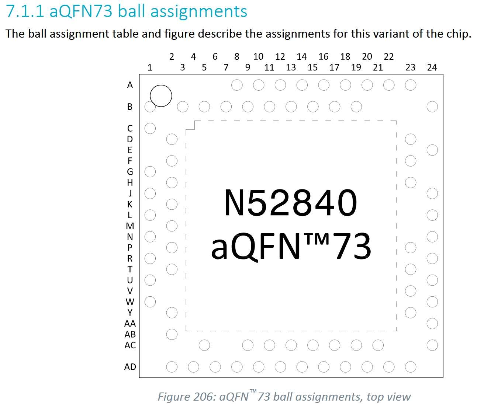

# nRF52840 APPROTECT glitch — WIRING: **Power-cycle attack** (the working one)

This is the wiring for the **cold power-cycle** attack (`nrf_attack.py` / `nrf_autopwn.py`) —
the one that **reliably unlocks** the part. The Pico powers the target's VDD and **cycles it off/on
each attempt**; the crowbar collapses the DEC1 core rail during the early (cold) boot, when DEC1 is
still ramping and weak, faulting the boot-ROM APPROTECT read.

> The reset (warm-boot) variant has its own wiring — see [`NRF52840_WIRING_RESET.md`](NRF52840_WIRING_RESET.md).
> Common crowbar/MOSFET/resistor/scope detail: [`NRF52840_GLITCH_SETUP.md`](NRF52840_GLITCH_SETUP.md).

```
        Raiden Pico (RP2350)                         nRF52840 (PCA10059, rev 2)
        ┌────────────────┐                           ┌─────────────────────────┐
        │ GP17  SWDCLK ──┼──────────────────────────►│ SWDCLK                  │
        │ GP18  SWDIO ──┼◄─────────────────────────►│ SWDIO                   │
        │ GP10 ┐         │                           │                         │
        │ GP11 ├ VDD ────┼──────────────────────────►│ VDD   (caps removed)    │ ◄ Pico powers + CYCLES VDD
        │ GP12 ┘         │                           │ DEC1  (1.3 V core rail) │ ◄ CROWBAR injection
        │ GP2  GLITCH ──┼──[Rg]──┐                   │ P0.13 pad (boot marker) │ ◄ scope only (bench cal)
        │ GND ───────────┼───┬────│───────────────────┤ GND                     │
        └────────────────┘   │    │ gate              └─────────────────────────┘
                             │    G
                             │  ┌─┴─┐  N-ch logic MOSFET (IRLZ44N)
                  [Rpd 10k] ─┤  │   │  drain ───────────────────────────────────► DEC1
                             │  └─┬─┘
                            GND   S
                                  │
                                [Rsrc 10 Ω]  ◄ amplitude knob
                                  │
                                 GND  (single common ground: Pico, MOSFET source-R, target, scope)
```

## Connections



| From (Pico) | To (nRF52840) | Purpose |
|---|---|---|
| **GP10 + GP11 + GP12** (ganged) | **VDD** | power the target **and power-cycle it** each attempt (direct, no series R) |
| **GP2** → `Rg` → MOSFET **gate** | — | glitch trigger (idle LOW; pulses HIGH for the glitch width) |
| MOSFET **drain** | **DEC1** | crowbar — collapses the 1.3 V core rail |
| MOSFET **source** → `Rsrc` → GND | — | amplitude tuning (10 Ω = fault-no-reset regime) |
| gate → `Rpd` → GND | — | hold MOSFET OFF at idle |
| **GP17** | **SWDCLK** | SWD clock |
| **GP18** | **SWDIO** | SWD data |
| **GND** | **GND** | one common ground for everything |
| GP22 *(optional)* | scope | `GLITCH_FIRED` marker (alt trigger) |

**Components:** `Rg` 10–100 Ω, `Rpd` 10 kΩ, `Rsrc` **10 Ω** (key knob), MOSFET = logic-level N-ch.
**Board prep:** remove the **DEC1 and VDD decoupling caps** (so the crowbar can collapse DEC1 and so
VDD discharges fast enough to power-cycle). DEC1 must be tapped on the **live die pin**, not a dead pad.

## Validated operating point (cracked the practice chip 3–7×, 2026-06-02)
- **WIDTH ≈ 225–265 cyc** (~1.5–1.77 µs @150 MHz). The one-shot locked boot needs a **stronger** pulse
  than the RAM-harness clean-skip band (165–180 was a red herring). Hits cluster at 255–265.
- **DELAY ≈ 1065–1170 µs after power-on** (broad ~110 µs window; the cold rail ramp dominates the
  timing — app-start ~1271 µs, the APPROTECT read precedes it). A wide blind sweep finds it.
- **OFF-time ≈ 18 ms** (rail fully discharges with caps removed → clean cold boot each attempt).
- **Detection = a real AHB read** (`FICR.INFO.PART == 0x52840`), not the unreliable APPROTECTSTATUS bit.
- A genuine hit shows **UICR.APPROTECT still = 0xFFFFFF00 (locked) while debug is open** = clean skip,
  not UICR corruption. Re-locks on the next power-cycle (transient bypass) → dump flash+RAM while open.

## Run it
```
# blind sweep (deployable form — no foreknowledge of exact delay/width):
./scripts/nrf_attack.py --d0 1050 --d1 1350 --dstep 3 --w0 225 --w1 265 --wstep 2 --off 18 --settle 4
# unattended, rotates windows until unlock:
./scripts/nrf_autopwn.py
```
On unlock (chip stays transiently open) it dumps:
- **flash** — 1 MiB @ `0x00000000` → `<out>.bin`
- **RAM** — 256 KiB @ `0x20000000` → `<out>.ram.bin`
- (optional) bounded **APB** `0x40000000` / **AHB** `0x50000000` peripheral samples via `scripts/nrf_dump_test.py`

See [`scripts/NRF_README.md`](scripts/NRF_README.md) → "What memory we dump" for the full memory map. ~1–2 min/unlock.
