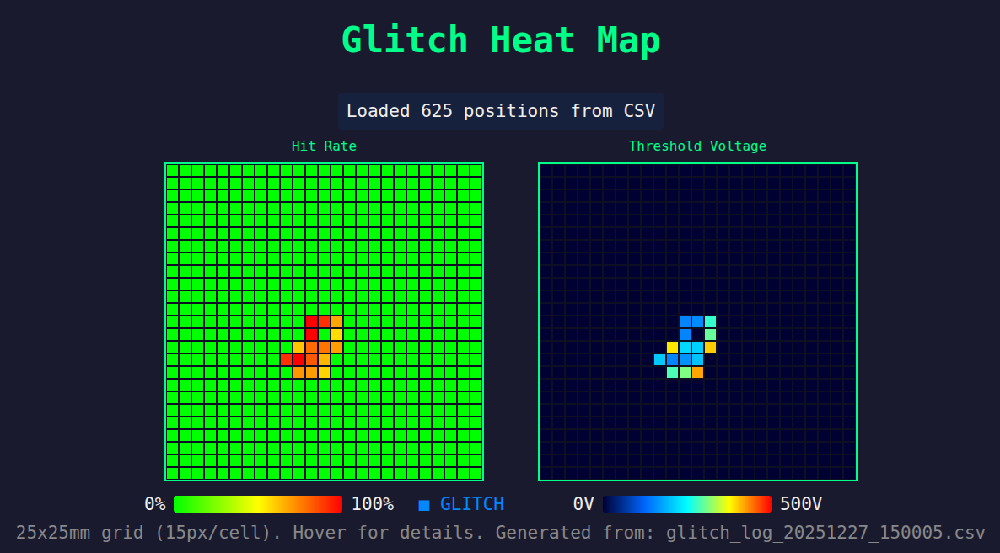

# Raiden Pico

A versatile glitching control platform built on the Raspberry Pi Pico 2 (RP2350), designed for hardware security research and fault injection experiments, written entirely by AI.

## Overview

Raiden Pico is a high-precision glitching tool that leverages the RP2350's PIO (Programmable I/O) state machines to generate precise glitch pulses for fault injection attacks. It supports multiple glitching methodologies including direct voltage glitching, ChipSHOUTER electromagnetic fault injection (EMFI), and clock glitching.

It was originally created as an experiment to see how useful AI could be in hardware hacking, but the goal has since evolved into making it the cheapest and most efficient glitching controller in order that it can be hardwired into test platforms to allow more reliable setups without having to waste or duplicate more expensive FPGA based controllers. 

All the code and test scripts in this project were written and tested by [Claude](https://www.claude.com/product/claude-code)*

The inspiration for the project came from discussions here: [Prompt||GTFO](https://www.knostic.ai/blog/prompt-gtfo-season-1).

\* Claude had full control of the Pico and a ChipShouter and was able to flash it and run against a real target. The only manual intervention required was validating timings etc. against an oscilloscope. I have not read a single line of code produced, only ran and tested it, so I cannot speak for the quality of the coding! YMMV!

### Key Features

- **Precise timing control**: PIO-based glitch generation with 6.67ns resolution (150 MHz system clock)
- **8 x Hardware UART**: Alternate configs are leveraged to share UART0/1 across multiple pinouts
- **Multiple trigger modes**: GPIO, UART byte matching, or software triggers
- **Platform support**: Manual, ChipSHOUTER EMFI, generic EMFI, and crowbar voltage glitching
- **Target support**: Built-in bootloader entry for LPC and STM32 microcontrollers
- **Command-line interface**: USB CDC serial interface with command shortcuts
- **GRBL XYZ support**: Direct UART control of GRBL CNC platform
- **Real-time monitoring**: UART snooping for target debugging

## Hardware Requirements

- **Raspberry Pi Pico 2** (RP2350)
- Target microcontroller
- Optional: ChipSHOUTER or voltage glitching hardware

## Installation

### Building from Source

```bash
# Set Pico SDK path
export PICO_SDK_PATH=/path/to/pico-sdk

# Build
./build.sh

# Flash
# 1. Hold BOOTSEL button while plugging in USB
# 2. Copy UF2 file:
cp build/raiden_pico.uf2 /media/$USER/RP2350/
```

Once flashed, for future updates the FLASH target can be used with make:

```
make FLASH
```

### Quick Flash via CLI

Connect to the Pico and reboot to bootloader:
```bash
# Connect to CLI
screen /dev/ttyACM0 115200

# Reboot to bootloader
REBOOT BL

# Then copy the UF2 file to the mounted drive
```

## Usage

### Connecting

```bash
screen /dev/ttyACM0 115200
# or
minicom -D /dev/ttyACM0 -b 115200
```

### Command Reference

All commands support non-ambiguous shortcuts (e.g., `STAT` for `STATUS`, `GL` for `GLITCH`, `TARG B` for `TARGET BOOTLOADER`).

#### API Mode (for scripting)

**`API [ON|OFF]`** - Enable/disable/show API mode
- Minimal output for script-friendly parsing
- Response format: `.` = received, `+` = success, `!` = failed

**`ERROR`** - Get last error message
- Returns the last error when a command fails in API mode

#### System Commands

**`HELP`** - Display command reference
- Shows all available commands with usage examples

**`STATUS`** - Show system status
- Displays chip variant, armed state, glitch parameters, trigger mode, and pin configuration

**`PINS`** - Show pin configuration
- Lists current GPIO assignments for glitch output, triggers, and platform control

**`RESET`** - Reset system to default state
- Clears all configuration and returns to power-on defaults

**`REBOOT [BL]`** - Reboot the Pico
- `REBOOT` - Soft reboot (restart firmware)
- `REBOOT BL` - Reboot to bootloader mode for firmware updates

**`DEBUG [ON|OFF]`** - Toggle/show target UART debug display
- When enabled, displays all data received from target UART in real-time
- Useful for monitoring target behavior during glitching

#### Glitch Configuration

**`SET [PAUSE|WIDTH|GAP|COUNT] [<cycles>]`** - Set/show glitch parameters
- Values in system clock cycles @ 150MHz (6.67ns per cycle)
- Example: `SET WIDTH 150` = 1µs pulse
- With no value, shows current settings

**`GET [PAUSE|WIDTH|GAP|COUNT]`** - Read current parameter values
- Query individual or all glitch parameters
- Example: `GET WIDTH`

#### Trigger Configuration

**`TRIGGER [NONE|GPIO|UART]`** - Configure/show trigger

**`TRIGGER NONE`** - Disable all triggers
- Glitches can only be manually fired with `GLITCH` command

**`TRIGGER GPIO <RISING|FALLING>`** - Configure GPIO trigger on GP3
- Trigger on edge detection of GP3 (fixed pin)
- Example: `TRIGGER GPIO RISING`
- Use case: Trigger from external signal or target GPIO

**`TRIGGER UART <byte>`** - Configure UART byte trigger
- Trigger when specific byte is received from target UART
- Byte value in hex (0-FF)
- Example: `TRIGGER UART 0D` (trigger on '\r')
- Use case: Trigger at specific point in target's execution

#### Platform Control

Raiden Pico supports multiple glitching platforms with different control requirements.

**`PLATFORM SET <MANUAL|CHIPSHOUTER|EMFI|CROWBAR>`**
- `MANUAL` - Direct control, no automatic platform management
- `CHIPSHOUTER` - NewAE ChipSHOUTER EMFI tool (UART control)
- `EMFI` - Generic EMFI platform with HV enable control
- `CROWBAR` - Voltage glitching with crowbar circuit

**`PLATFORM VOLTAGE <mv>`** - Set platform voltage
- For voltage glitching platforms
- Value in millivolts
- Example: `PLATFORM VOLTAGE 3300` (3.3V)

**`PLATFORM CHARGE <ms>`** - Set charge time
- For EMFI platforms that require capacitor charging
- Value in milliseconds
- Example: `PLATFORM CHARGE 100`

**`PLATFORM HVPIN <pin>`** - Set HV enable pin
- GPIO pin that controls high voltage enable
- Example: `PLATFORM HVPIN 15`

**`PLATFORM VPIN <pin>`** - Set voltage control pin
- GPIO pin for voltage control (PWM or analog)
- Example: `PLATFORM VPIN 14`

#### Glitch Execution

**`ARM [ON|OFF]`** - Arm/disarm/show glitch system
- Must be armed before glitches will fire on triggers
- Safety feature to prevent accidental glitching
- Example: `ARM ON`

**`GLITCH`** - Manually fire a single glitch
- Immediately generates glitch pulse(s)
- Works regardless of trigger configuration
- Useful for testing glitch parameters

#### Clock Generator

**`CLOCK [<freq>] [ON|OFF]`** - Set/get clock frequency and enable/disable
- Generates clock signal on GP6
- Example: `CLOCK 12000000 ON` (12MHz clock)
- Example: `CLOCK OFF` (disable clock)

#### Target Control

Raiden Pico includes built-in support for entering bootloader mode on common microcontrollers.

**`TARGET <LPC|STM32>`** - Set target microcontroller type
- Configures bootloader entry protocol
- `LPC` - NXP LPC series (ISP protocol)
- `STM32` - STMicroelectronics STM32 series

**`TARGET BOOTLOADER [baud] [crystal_khz]`** - Enter bootloader
- Initialize target UART and enter bootloader mode
- Defaults: 115200 baud, 12000 kHz crystal
- LPC example: `TARGET BOOTLOADER 115200 12000`
- STM32 example: `TARGET BOOTLOADER 115200`

**`TARGET SYNC [baud] [crystal_khz] [reset_delay_ms] [retries]`** - Reset and enter bootloader
- Performs target reset, waits, then enters bootloader
- Includes automatic retry logic for reliability
- Defaults: 115200 baud, 12000 kHz crystal, 10ms reset delay, 5 retries
- Example: `TARGET SYNC 115200 12000 10 5`

**`TARGET SEND <hex|"text">`** - Send data to target
- Send hex bytes or quoted text to target UART
- Hex: `TARGET SEND 3F` (sends 0x3F)
- Text: `TARGET SEND "hello"` (automatically appends \r)

**`TARGET RESPONSE`** - Display target response buffer
- Shows data received from target UART
- Useful after sending bootloader commands

**`TARGET RESET [PERIOD <ms>] [PIN <n>] [HIGH]`** - Reset target
- Pulses reset pin to restart target
- Defaults: 300ms pulse, GPIO 15, active low
- Example: `TARGET RESET PERIOD 500 PIN 16 HIGH`

**`TARGET POWER [ON|OFF|CYCLE] [ms]`** - Control/show target power on GP10
- `ON` - Enable power
- `OFF` - Disable power
- `CYCLE` - Power cycle with optional duration (default: 300ms)

**`TARGET TIMEOUT [<ms>]`** - Get/set transparent bridge timeout
- Default: 50ms

#### ChipSHOUTER Control

Built-in UART control for NewAE ChipSHOUTER EMFI tool.

**`CS ARM`** - Arm ChipSHOUTER
- Prepares ChipSHOUTER for firing
- Required before pulses can be generated

**`CS DISARM`** - Disarm ChipSHOUTER
- Safety disarm ChipSHOUTER
- Prevents accidental pulses

**`CS FIRE`** - Manually fire ChipSHOUTER
- Triggers single electromagnetic pulse
- ChipSHOUTER must be armed first

**`CS STATUS`** - Get ChipSHOUTER status
- Queries voltage, armed state, and configuration
- Returns UART response from ChipSHOUTER

**`CS VOLTAGE [<V>]`** - Set/get ChipSHOUTER voltage
- Configure pulse voltage (device-specific range)
- Example: `CS VOLTAGE 250`

**`CS PULSE [<ns>]`** - Set/get ChipSHOUTER pulse width
- Configure pulse duration in nanoseconds
- Example: `CS PULSE 50`

**`CS TRIGGER HW <HIGH|LOW>`** - Set hardware trigger mode
- Configures ChipSHOUTER to trigger on glitch output pin
- `HIGH` - Active high trigger (pin idles low with pull-down)
- `LOW` - Active low trigger (pin idles high with pull-up)
- Example: `CS TRIGGER HW HIGH`

**`CS TRIGGER SW`** - Set software trigger mode
- ChipSHOUTER fires when interrupt routine calls `CS FIRE`
- Disables hardware trigger input

**`CS RESET`** - Reset ChipSHOUTER
- Clears errors and reinitializes ChipSHOUTER
- Verifies error state is cleared

**`CS FAULTS`** - Get ChipSHOUTER fault status
- Query current fault conditions

**`CS HVOUT`** - Get ChipSHOUTER HV output status
- Query high voltage output state

#### GRBL XY Platform Control

Built-in UART control for GRBL-based XY positioning platforms (CNC routers, laser cutters, etc.) useful for automated EMFI probe positioning.

**Note**: The system uses UART1 for both Target (GP4/GP5) and GRBL (GP8/GP9). Only one can be active at a time - switching between them reconfigures the UART automatically.

**`GRBL SEND <gcode>`** - Send raw G-code command
- Send any G-code directly to GRBL controller
- Example: `GRBL SEND G0 X10 Y10`

**`GRBL UNLOCK`** - Unlock alarm state
- Sends `$X` to clear GRBL alarm
- Enables movement without requiring homing

**`GRBL SET HOME`** - Set current position as home
- Sets current XY position as origin (0,0,0)
- Sends `G92 X0 Y0 Z0`

**`GRBL HOME [timeout_ms]`** - Move to home position
- Synchronous move to (0,0) coordinates
- Default timeout: 30000ms

**`GRBL AUTOHOME [timeout_ms]`** - Auto-home with limit switches
- Sends `$H` to trigger GRBL's homing cycle
- Requires limit switches configured on GRBL controller
- Default timeout: 60000ms

**`GRBL MOVE <X> <Y> [F] [timeout_ms]`** - Move to absolute position
- Synchronous move to specified XY coordinates
- Optional feed rate in mm/min (default: 300)
- Example: `GRBL MOVE 15 20` or `GRBL MOVE 15 20 500`

**`GRBL STEP <DX> <DY> [F] [timeout_ms]`** - Move relative distance
- Synchronous move by specified offset from current position
- Optional feed rate in mm/min (default: 300)
- Example: `GRBL STEP 5 -3` (move +5mm X, -3mm Y)

**`GRBL POS`** - Get current position
- Query current XYZ coordinates from GRBL
- Returns position in machine coordinates

**`GRBL RESET`** - Soft reset GRBL
- Sends Ctrl-X (0x18) to reset GRBL controller
- Use to recover from error states

## Typical Workflow

### 1. Basic Voltage Glitching

```bash
# Configure glitch parameters
SET PAUSE 1000      # 6.67µs before glitch
SET WIDTH 150       # 1µs glitch pulse
SET COUNT 1         # Single pulse (output on GP2/GP7)

# Set up trigger on GP3
TRIGGER GPIO RISING

# Configure platform
PLATFORM SET CROWBAR
PLATFORM VOLTAGE 3300

# Arm and test
ARM ON
STATUS              # Verify configuration
```

### 2. UART-Triggered Glitching

```bash
# Set target type
TARGET LPC

# Enter bootloader
TARGET SYNC 115200 12000 300

# Configure UART trigger
TRIGGER UART 0D     # Trigger on '\r' (13)

# Configure glitch
SET PAUSE 500
SET WIDTH 100
ARM ON
TARGET SEND "R 0 516096"
```

### 3. ChipSHOUTER EMFI

```bash
# Configure ChipSHOUTER
CS VOLTAGE 250
CS PULSE 50
CS ARM

# Set up hardware trigger
CS TRIGGER HW HIGH

# Configure Raiden timing (output on GP2)
SET PAUSE 2000
SET WIDTH 200

# Trigger from GP3
TRIGGER GPIO RISING
ARM ON
```

## Heatmap Visualization Tools

The project includes Python scripts for automated XY scanning with real-time heatmap visualization.

[](examples/heatmap_example.html)

### Live Heatmap (`glitch_heatmap.py`)

Run automated scans with live web-based visualization:

```bash
# Basic scan (25x25 grid, spiral from corner)
python3 glitch_heatmap.py

# Reverse spiral starting from center
python3 glitch_heatmap.py --reverse --start-x 12 --start-y 12
```

Open http://localhost:8080 to view the live dual heatmap showing:
- **Hit Rate**: Green (0%) to Red (100%), Blue for successful glitches
- **Threshold Voltage**: Dark blue (0V) to Red (500V)

### CSV to Heatmap (`csv_to_heatmap.py`)

Regenerate heatmaps from CSV log files:

```bash
python3 csv_to_heatmap.py glitch_log_20251227.csv
```

### Example Output

See [examples/heatmap_example.html](examples/heatmap_example.html) for an interactive example heatmap with dual grids showing hit rate and threshold voltage across a 25x25mm scan area.

## Pin Configuration

### Default Pinout

- **GPIO 2** - Glitch output (default)
- **GPIO 4** - Target UART TX
- **GPIO 5** - Target UART RX (also PIO monitored for UART triggers)
- **GPIO 15** - Target reset (active low)

### ChipSHOUTER Connection

- **GPIO 0** - ChipSHOUTER UART TX
- **GPIO 1** - ChipSHOUTER UART RX
- **GPIO 2** - Hardware trigger output (connects to ChipSHOUTER trigger input)

### GRBL XY Platform Connection

- **GPIO 8** - GRBL UART TX (UART1 alternate function)
- **GPIO 9** - GRBL UART RX (UART1 alternate function)

**Note**: GRBL uses UART1 which is shared with Target UART (GP4/GP5). Only one can be active at a time - commands auto-switch as needed.

## Architecture

### PIO State Machines

Raiden Pico uses the RP2350's PIO for precise timing-critical operations only:

- **PIO0 SM0** - GPIO edge detection for trigger input
- **PIO0 SM1** - Glitch pulse generation with cycle-accurate timing
- **PIO0 SM2** - UART RX decoder for byte-matching triggers (monitors GP5)
- **PIO0 SM3** - Clock generator for manual glitch triggering

### Hardware Peripherals

Non-timing-critical communications use standard hardware peripherals which can be shared by using alternate pin configs, 
effictively increasing the hardware UART capability from 2 to 8:

- **UART0** (GP0/GP1) - ChipSHOUTER communication (115200 baud)
- **UART1** (GP4/GP5) - Target device communication (configurable baud)
- **UART1** (GP8/GP9) - GRBL XYZ platform control

### Interrupt-Driven Design

- Target UART triggers are detected by PIO and generate IRQs
- Glitch execution happens in interrupt context for minimal latency
- Non-blocking UART reads prevent missed triggers

## Troubleshooting

### Target bootloader sync fails

LPC ISP sync typically requires 1-2 retries. Use `TARGET SYNC` which includes automatic retry logic:
```bash
TARGET LPC
TARGET SYNC 115200 12000 300
```

### No glitches generated

Check the following:
1. Is system armed? (`ARM ON`)
2. Is trigger configured? (`STATUS` to verify)
3. For GPIO triggers, is signal connected?
4. For UART triggers, is target sending data? (`DEBUG ON` to monitor)

### ChipSHOUTER not responding

1. Verify UART connection (GPIO 0/1)
2. Check baud rate (should be 115200)
3. Use `CS RESET` to reinitialize
4. Check with `CS STATUS`

## Technical Details

- **System Clock**: 150 MHz
- **Timing Resolution**: 6.67 ns (1 clock cycle)
- **UART Baud Rates**: Up to 921600 (configurable)
- **Glitch Width Range**: 1 cycle to 2^32 cycles (6.67ns to 28.6 seconds)
- **Trigger Latency**: < 1µs (PIO to glitch output)

## Safety Considerations

⚠️ **WARNING**: Fault injection can permanently damage hardware.

- Always verify glitch parameters before arming
- Start with conservative settings (longer pause, shorter width)
- Use `GLITCH` command to test before enabling triggers
- Keep target voltage within safe operating range
- ChipSHOUTER can generate high electromagnetic fields - follow device safety guidelines

## Development

### Building

```bash
export PICO_SDK_PATH=/path/to/pico-sdk
mkdir build && cd build
cmake ..
make -j4
```

### Project Structure

```
raiden-pico/
├── src/           - C source files
├── include/       - Header files
├── build/         - Build artifacts
├── CMakeLists.txt - Build configuration
└── *.md          - Documentation
```

## License

This project is for hardware security research and educational purposes. Use responsibly and only on hardware you own or have permission to test.

## References

- [RP2350 Datasheet](https://datasheets.raspberrypi.com/rp2350/rp2350-datasheet.pdf)
- [ChipSHOUTER Documentation](https://chipshouter.readthedocs.io/)
- [Pico SDK Documentation](https://www.raspberrypi.com/documentation/pico-sdk/)

## Contributing

Contributions welcome! This project is maintained at https://github.com/AdamLaurie/raiden-pico

---

**Raiden Pico** - Precision fault injection for hardware security research
