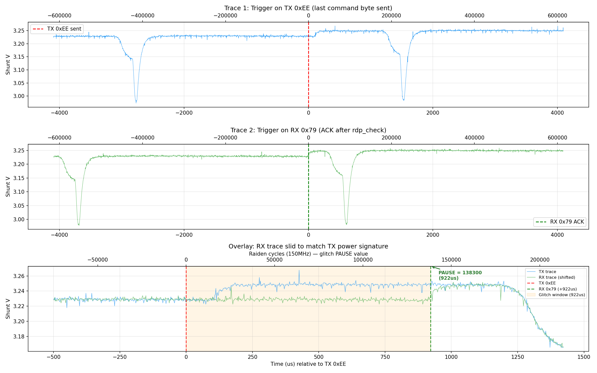
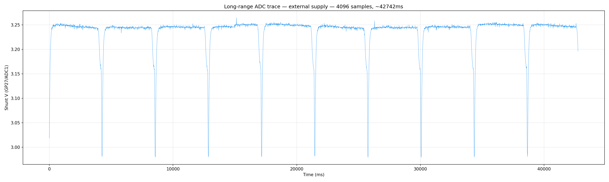
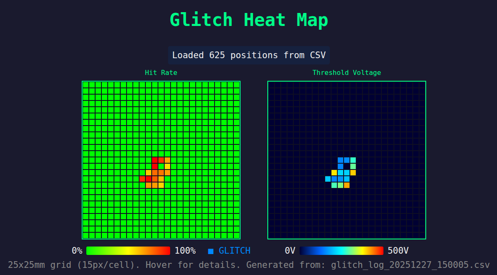

# Raiden Pico

A versatile glitching control platform built on the Raspberry Pi Pico 2 (RP2350), designed for hardware security research and fault injection experiments, written entirely by AI.

## Overview

Raiden Pico is a high-precision glitching tool that leverages the RP2350's PIO (Programmable I/O) state machines to generate precise glitch pulses for fault injection attacks. It supports multiple glitching methodologies including direct voltage glitching, ChipSHOUTER electromagnetic fault injection (EMFI), and clock glitching.

It was originally created as an experiment to see how useful AI could be in hardware hacking, but the goal has since evolved into making it the cheapest and most efficient glitching controller in order that it can be hardwired into test platforms to allow more reliable setups without having to waste or duplicate more expensive FPGA based controllers. 

All the code and test scripts in this project were written and tested by [Claude](https://www.claude.com/product/claude-code)*

The inspiration for the project came from discussions here: [Prompt||GTFO](https://www.knostic.ai/blog/prompt-gtfo-season-1).

Full story in my [unprompted con talk "AI Go Beep Boop!"](https://www.youtube.com/watch?v=_tqqnkemYsg).

\* Claude had full control of the Pico and a ChipShouter and was able to flash it and run against a real target. The only manual intervention required was validating timings etc. against an oscilloscope. I have not read a single line of code produced, only ran and tested it, so I cannot speak for the quality of the coding! YMMV!

### Key Features

- **Precise timing control**: PIO-based glitch generation with 6.67ns resolution (150 MHz system clock)
- **8 x Hardware UART**: Alternate configs are leveraged to share UART0/1 across multiple pinouts
- **Multiple trigger modes**: GPIO, UART byte matching, or software triggers
- **Platform support**: Manual, ChipSHOUTER EMFI, generic EMFI, and crowbar voltage glitching
- **Target support**: Built-in bootloader entry for LPC and STM32 microcontrollers
- **Command-line interface**: USB CDC serial interface with command shortcuts
- **GRBL XYZ support**: Direct UART control of GRBL CNC platform
- **SWD/JTAG debug**: Bit-banged SWD and JTAG for ARM target debugging, flash dumping, and RDP inspection
- **Real-time monitoring**: UART snooping for target debugging

## Hardware Requirements

- **Raspberry Pi Pico 2** (RP2350)
- Target microcontroller
- Optional: ChipSHOUTER or voltage glitching hardware

## Installation

### Building from Source

```bash
# Set Pico SDK path
export PICO_SDK_PATH=/path/to/pico-sdk

# Ensure pico-sdk submodules are initialized
cd $PICO_SDK_PATH && git submodule update --init --recursive && cd -

# Build
./build.sh

# Flash
# 1. Hold BOOTSEL button while plugging in USB
# 2. Copy UF2 file:
cp build/raiden_pico.uf2 /media/$USER/RP2350/
```

Once flashed, for future updates the FLASH target can be used with make:

```
make FLASH
```

### Quick Flash via CLI

Connect to the Pico and reboot to bootloader:
```bash
# Connect to CLI
screen /dev/ttyACM0 115200

# Reboot to bootloader
REBOOT BL

# Then copy the UF2 file to the mounted drive
```

### Hardware Reset via FTDI (optional but recommended)

If the firmware ever hangs and stops responding to `REBOOT BL`, you can
reset the Pico 2 from the host by wiring an FTDI breakout's DTR line to
the Pico 2's `EN` (RUN) pin (share GND too):

```
FTDI DTR  →  Pico 2 EN
FTDI GND  →  Pico 2 GND
```

Then pulse it from the host:
```bash
python3 scripts/reset_pico.py                          # default: /dev/ttyUSB0, 100ms
python3 scripts/reset_pico.py --wait                   # also confirm ttyACM0 comes back
python3 scripts/reset_pico.py --port /dev/ttyUSB1      # use a different FTDI port
python3 scripts/reset_pico.py --ms 200                 # longer reset pulse
python3 scripts/reset_pico.py --port /dev/ttyUSB1 --ms 200 --wait
```

Arguments:

| Flag | Default | Description |
|---|---|---|
| `--port <dev>` | `/dev/ttyUSB0` | FTDI serial device whose DTR pin is wired to EN |
| `--ms <n>`     | `100`          | DTR-low pulse duration in milliseconds |
| `--wait`       | off            | After resetting, wait for `/dev/ttyACM0` to enumerate and confirm with `VERSION` |

`PINS` in the CLI mentions this under "External Reset (suggested)".

## Usage

### Connecting

```bash
screen /dev/ttyACM0 115200
# or
minicom -D /dev/ttyACM0 -b 115200
```

### Command Reference

All commands support non-ambiguous shortcuts (e.g., `STAT` for `STATUS`, `GL` for `GLITCH`, `TARG B` for `TARGET BOOTLOADER`).

#### API Mode (for scripting)

**`API [ON|OFF]`** - Enable/disable/show API mode
- Minimal output for script-friendly parsing
- Response format: `.` = received, `+` = success, `!` = failed

**`ERROR`** - Get last error message
- Returns the last error when a command fails in API mode

#### System Commands

**`HELP`** - Display command reference
- Shows all available commands with usage examples

**`STATUS`** - Show system status
- Displays chip variant, armed state, glitch parameters, trigger mode, and pin configuration

**`PINS`** - Show pin configuration
- Lists current GPIO assignments for glitch output, triggers, and platform control

**`RESET`** - Reset system to default state
- Clears all configuration and returns to power-on defaults

**`REBOOT [BL]`** - Reboot the Pico
- `REBOOT` - Soft reboot (restart firmware)
- `REBOOT BL` - Reboot to bootloader mode for firmware updates

**`DEBUG [ON|OFF]`** - Toggle/show target UART debug display
- When enabled, displays all data received from target UART in real-time
- Useful for monitoring target behavior during glitching

#### Glitch Configuration

**`SET [PAUSE|WIDTH|GAP|COUNT] [<cycles>]`** - Set/show glitch parameters
- Values in system clock cycles @ 150MHz (6.67ns per cycle)
- Example: `SET WIDTH 150` = 1µs pulse
- With no value, shows current settings

**`GET [PAUSE|WIDTH|GAP|COUNT|VMIN]`** - Read current parameter values
- Query individual or all glitch parameters
- Example: `GET WIDTH`

**`SET VMIN <mV>`** - ADC-gated glitch-depth threshold (millivolts)
- **Wiring required:** the target's reference rail (e.g. JTAG `VTref`,
  the chip's VDD pin, or whichever rail you intend to monitor while
  glitching) must be wired to **GP26 (ADC1)**. Without that wire the
  CPU has nothing to gate on and the glitch will never reach its
  threshold. Verify with `ADC 1` — should return the target's idle
  voltage (or a divided version of it).
- `0` (default) = disabled. Glitches use the standard time-based PIO pulse
  defined by WIDTH/GAP/PAUSE/COUNT.
- Non-zero = enables **ADC-gated** glitching: instead of releasing the rail
  after a fixed time, the CPU polls ADC0 (GP26) during the drop and releases
  only once the probed voltage reaches the configured threshold. WIDTH is
  then re-interpreted as the *minimum dwell time past threshold* (in
  cycles ÷ 150 = µs), so the rail is held LOW for at least that long even
  after the ADC trips — useful for letting core decoupling caps drain
  further than the I/O rail.
- Example: `SET VMIN 500` `SET WIDTH 15000` → drop the rail until ADC reads
  ≤ 500 mV (probe-space), then hold for 100 µs before restoring.
- `SET WIDTH 0` → release the rail *immediately* once the ADC hits VMIN,
  no dwell. This is the right default for chips whose protection logic
  sits on a low-capacitance rail where dwell adds nothing useful (and
  for inrush-sensitive setups where the shorter time at LOW is safer
  for the Pico's GPIO sink pads).
- VMIN's depth control applies to commands that route through the
  CPU-side ADC primitive — currently `TARGET GLITCH LPCBYPASS` (and the
  STM32 sweep/test routines that already use ADC gating). PIO-driven
  triggers (UART/GPIO) still use WIDTH-only timed pulses until VMIN is
  wired into that path.
- See [VMIN.md](VMIN.md) for the math (RC time constants vs decoupling
  caps) and the cap-strip experimental procedure used to reach µs-scale
  transients from the GP10/11/12 sink path.

#### Trigger Configuration

**`TRIGGER [NONE|GPIO|UART]`** - Configure/show trigger

**`TRIGGER NONE`** - Disable all triggers
- Glitches can only be manually fired with `GLITCH` command

**`TRIGGER GPIO <RISING|FALLING>`** - Configure GPIO trigger on GP3
- Trigger on edge detection of GP3 (fixed pin)
- Example: `TRIGGER GPIO RISING`
- Use case: Trigger from external signal or target GPIO

**`TRIGGER UART <byte> [TX|RX]`** - Configure UART byte trigger
- Trigger when specific byte is seen on target UART
- Byte value in hex (0-FF)
- `TX` = sniff Raiden TX (GP4, bytes sent to target)
- `RX` = sniff Raiden RX (GP5, bytes received from target, default)
- Example: `TRIGGER UART 0D` (trigger on '\r' from target)
- Example: `TRIGGER UART EE TX` (trigger on 0xEE sent to target)
- PIO-based decoder works with 8N1, 8E1, or any parity mode

#### Platform Control

Raiden Pico supports multiple glitching platforms with different control requirements.

**`PLATFORM SET <MANUAL|CHIPSHOUTER|EMFI|CROWBAR>`**
- `MANUAL` - Direct control, no automatic platform management
- `CHIPSHOUTER` - NewAE ChipSHOUTER EMFI tool (UART control)
- `EMFI` - Generic EMFI platform with HV enable control
- `CROWBAR` - Voltage glitching with crowbar circuit

**`PLATFORM VOLTAGE <mv>`** - Set platform voltage
- For voltage glitching platforms
- Value in millivolts
- Example: `PLATFORM VOLTAGE 3300` (3.3V)

**`PLATFORM CHARGE <ms>`** - Set charge time
- For EMFI platforms that require capacitor charging
- Value in milliseconds
- Example: `PLATFORM CHARGE 100`

**`PLATFORM HVPIN <pin>`** - Set HV enable pin
- GPIO pin that controls high voltage enable
- Example: `PLATFORM HVPIN 15`

**`PLATFORM VPIN <pin>`** - Set voltage control pin
- GPIO pin for voltage control (PWM or analog)
- Example: `PLATFORM VPIN 14`

#### Glitch Execution

**`ARM [ON|OFF]`** - Arm/disarm/show glitch system
- Must be armed before glitches will fire on triggers
- Safety feature to prevent accidental glitching
- Example: `ARM ON`

**`GLITCH`** - Manually fire a single glitch
- Immediately generates glitch pulse(s)
- Works regardless of trigger configuration
- Useful for testing glitch parameters

#### Clock Generator

**`CLOCK [<freq>] [ON|OFF]`** - Set/get clock frequency and enable/disable
- Generates clock signal on GP6
- Example: `CLOCK 12000000 ON` (12MHz clock)
- Example: `CLOCK OFF` (disable clock)

#### ADC Trace (Shunt Current Capture)

Capture target power consumption via a shunt resistor on GP27/ADC1. Place a 1-10 ohm resistor in series with the target's VDD supply and connect GP27 across it (high side to ADC, low side to GND). A 10 ohm shunt gives good sensitivity for low-power targets like STM32F1 (~20-50mA); use 1 ohm for higher-current targets to stay within the ADC's 0-3.3V range. The ADC samples at ~500ksps (~2us/sample) into a circular DMA buffer, triggered by the same PIO trigger used for glitching. This allows profiling the target's current draw around security-critical operations like RDP checks.

**`TRACE [samples] [pre%]`** - Start ADC trace
- Default: 4096 samples, 50% pre-trigger
- Example: `TRACE 8192 25` (8192 samples, 25% pre-trigger)

**`TRACE STATUS`** - Check trace state (IDLE/RUNNING/COMPLETE)

**`TRACE DUMP`** - Dump raw ADC samples (hex, repeatable)
- Can be called multiple times without clearing buffer

**`TRACE RESET`** - Discard trace buffer and reset to IDLE

**`TRACE RATE <clkdiv>`** - Set ADC sample rate
- `clkdiv=0` (default): ~2us/sample (~500ksps), best for short captures
- `clkdiv=50`: ~100us/sample, for medium-range captures
- `clkdiv=500`: ~1ms/sample, for long-range captures (~4 seconds with 4096 samples)
- Example: `TRACE RATE 500` then `TRACE 4096 50` captures ~4s of data

**`ARM TRACE`** / **`TRACE ARM`** - Arm trigger for trace-only capture
- Like `ARM ON` but only captures ADC data, no glitch pulse generated
- Trigger fires GP22 which stops DMA capture

##### Workflow

```bash
# Configure trigger (e.g., UART byte match)
TRIGGER UART 79 RX

# Start trace buffer
TRACE 4096 50

# Arm for trace-only (no glitch output)
ARM TRACE

# Send command to target (triggers capture)
TARGET SEND 11EE

# Check and dump
TRACE STATUS
TRACE DUMP

# Clean up
ARM OFF
TRACE RESET
```

##### Dual Trace: Finding the Glitch Window

By running two traces with different trigger bytes, you can measure the exact time window between sending a command and receiving the response — the window during which the target executes security-critical code. Multiple runs with median averaging reject periodic noise (e.g., watchdog resets) while preserving the true power signature.



*Example: STM32F1 Read Memory command (15-run median). TX trace triggers on 0xEE (last command byte sent), RX trace triggers on 0x79 (ACK after rdp_check). The overlay shows the 98µs glitch window (14,700 Raiden cycles at 150MHz) between command and response — the interval where the RDP check executes. Top axis shows Raiden PIO cycles for direct use as the glitch PAUSE parameter.*

See [`scripts/stm32_dual_trace.py`](scripts/stm32_dual_trace.py) for the full automation script (multi-run median with power cycling), and [`scripts/stm32_single_trace.py`](scripts/stm32_single_trace.py) for single-trigger capture.

##### Periodic Artifact in Single-Run Traces

Single-run traces contain large periodic current dips (~every 4-5 seconds) unrelated to target code execution — they appear identically whether the STM32 core is running or halted via SWD. The source is unknown (possibly IWDG watchdog resets or USB power regulation). These dips corrupt single-run measurements and make cross-correlation alignment unreliable, which is why the dual trace script uses median averaging across multiple power-cycled runs to reject them.



*Long-range ADC capture (~43 seconds) showing the periodic artifact. These dips are 200-300mV deep and occur regardless of target execution state.*

#### Target Control

Raiden Pico includes built-in support for entering bootloader mode on common microcontrollers.

**`TARGET <LPC|STM32>`** - Set target microcontroller type
- Configures bootloader entry protocol
- `LPC` - NXP LPC series (ISP protocol)
- `STM32` - STMicroelectronics STM32 series

**`TARGET BOOTLOADER [baud] [crystal_khz]`** - Enter bootloader
- Initialize target UART and enter bootloader mode
- Defaults: 115200 baud, 12000 kHz crystal
- LPC example: `TARGET BOOTLOADER 115200 12000`
- STM32 example: `TARGET BOOTLOADER 115200`

**`TARGET SYNC [baud] [crystal_khz] [reset_delay_ms] [retries]`** - Reset and enter bootloader
- Performs target reset, waits, then enters bootloader
- Includes automatic retry logic for reliability
- Defaults: 115200 baud, 12000 kHz crystal, 10ms reset delay, 5 retries
- Example: `TARGET SYNC 115200 12000 10 5`

**`TARGET SEND <hex|"text">`** - Send data to target
- Send hex bytes or quoted text to target UART
- Hex: `TARGET SEND 3F` (sends 0x3F)
- Text: `TARGET SEND "hello"` (automatically appends \r)

**`TARGET RESPONSE`** - Display target response buffer
- Shows data received from target UART
- Useful after sending bootloader commands

**`TARGET RESET [PERIOD <ms>] [PIN <n>] [HIGH]`** - Reset target
- Pulses reset pin to restart target
- Defaults: 300ms pulse, GPIO 15, active low
- Example: `TARGET RESET PERIOD 500 PIN 16 HIGH`

**`TARGET POWER [ON|OFF|CYCLE] [ms]`** - Control/show target power on GP10/11/12
- `ON` - Enable power
- `OFF` - Disable power
- `CYCLE` - Power cycle with optional duration (default: 300ms)
- In `EXTERNAL` mode these drive **GP10 only** (the supply enable); GP11/GP12 are not touched.

**`TARGET POWER MODE [INT|EXT [AHIGH|ALOW]]`** - Select how the GP10/11/12 group is driven
- `INT` (default) - GP10/11/12 ganged as the target power source/sink (current behaviour).
- `EXT` - GP10 = supply enable, **GP11 = crowbar gate** (PIO-driven, emits the same glitch
  waveform as GP2 for any trigger type), GP12 = reserved spare.
- `AHIGH` (default) - crowbar gate asserts HIGH, idle LOW (low-side N-FET).
- `ALOW` - crowbar gate asserts LOW, idle HIGH (high-side P-FET / active-low driver).
- Bare `TARGET POWER MODE` prints the current mode + gate polarity. Disarm (`ARM OFF`)
  before switching. The CPU-side power-group glitch routines (`SWEEP`/`GLITCH`/`PAYLOAD`/
  `BYPASS`/LPC bypass) are refused in `EXT` mode — use the PIO crowbar (`ARM` + trigger).

**`TARGET POWER SWEEP`** - Calibrate voltage glitch threshold
- Ramps target power down via ADC monitoring to find brown-out reset voltage
- Required before PAYLOAD or BYPASS commands

**`TARGET POWER GLITCH <voltage> [count]`** - Power glitch attack
- Glitch target power to specified voltage threshold
- Default: 1 attempt

**`TARGET POWER PAYLOAD <voltage> [attempts]`** - Glitch with bootloader re-entry
- Power glitch then re-enter bootloader to check for ISP code readout bypass

**`TARGET POWER BYPASS [attempts] [count]`** - RDP1 flash dump via FPB redirect [STM32F1]
- Two-stage attack: POR glitch → FPB redirect → UART flash dump at 115200 baud
- Default: 20 attempts, full flash size
- See [STM32F1 RDP1 Bypass Workflow](#4-stm32f1-rdp1-bypass) below

**`TARGET TIMEOUT [<ms>]`** - Get/set transparent bridge timeout
- Default: 50ms

#### ChipSHOUTER Control

Built-in UART control for NewAE ChipSHOUTER EMFI tool.

**`CS ARM`** - Arm ChipSHOUTER
- Prepares ChipSHOUTER for firing
- Required before pulses can be generated

**`CS DISARM`** - Disarm ChipSHOUTER
- Safety disarm ChipSHOUTER
- Prevents accidental pulses

**`CS FIRE`** - Manually fire ChipSHOUTER
- Triggers single electromagnetic pulse
- ChipSHOUTER must be armed first

**`CS STATUS`** - Get ChipSHOUTER status
- Queries voltage, armed state, and configuration
- Returns UART response from ChipSHOUTER

**`CS VOLTAGE [<V>]`** - Set/get ChipSHOUTER voltage
- Configure pulse voltage (device-specific range)
- Example: `CS VOLTAGE 250`

**`CS PULSE [<ns>]`** - Set/get ChipSHOUTER pulse width
- Configure pulse duration in nanoseconds
- Example: `CS PULSE 50`

**`CS TRIGGER HW <HIGH|LOW>`** - Set hardware trigger mode
- Configures ChipSHOUTER to trigger on glitch output pin
- `HIGH` - Active high trigger (pin idles low with pull-down)
- `LOW` - Active low trigger (pin idles high with pull-up)
- Example: `CS TRIGGER HW HIGH`

**`CS TRIGGER SW`** - Set software trigger mode
- ChipSHOUTER fires when interrupt routine calls `CS FIRE`
- Disables hardware trigger input

**`CS RESET`** - Reset ChipSHOUTER
- Clears errors and reinitializes ChipSHOUTER
- Verifies error state is cleared

**`CS FAULTS`** - Get ChipSHOUTER fault status
- Query current fault conditions

**`CS HVOUT`** - Get ChipSHOUTER HV output status
- Query high voltage output state

#### SWD Debug Interface

Bit-banged SWD (Serial Wire Debug) for ARM Cortex-M targets. Supports connecting, reading/writing registers and memory, and STM32-specific operations like RDP readout and option byte inspection.

**`SWD CONNECT`** - Connect to target via SWD
- Performs line reset + JTAG-to-SWD switch sequence
- Reads and displays DPIDR on success

**`SWD CONNECTRST`** - Connect under reset
- Holds nRST, connects via SWD, halts core, releases nRST
- Required for modifying option bytes on RDP-protected targets

**`SWD IDCODE`** - Identify connected target
- Reads DPIDR, CPUID, and STM32 debug ID code
- Decodes ARM part number and STM32 device variant

**`SWD HALT`** / **`SWD RESUME`** - Halt/resume target core
- Uses DHCSR debug register to control execution
- Required before register reads or SRAM writes

**`SWD REGS`** - Read core registers
- Displays r0-r15, xPSR, MSP, PSP while halted

**`SWD FILL <addr|region> <value> [n] [ERASE]`** - Fill memory with pattern
- Fills n words (default: full region for aliases, 1 for raw address)
- Flash addresses auto-detected — requires ERASE keyword to confirm page erase
- Examples: `SWD FILL SRAM DEADBEEF 16`, `SWD FILL 08000000 CAFEF00D 8 ERASE`

**`SWD FLASH ERASE <page>`** - Erase a flash page

**`SWD OPT`** - Read option bytes
- Displays all option registers for the selected STM32 family

**`SWD RDP`** - Read RDP (readout protection) level
- Requires TARGET set to an STM32 family
- Returns level 0, 1, or 2

**`SWD RDP SET <0|1>`** - Set RDP level
- Setting to 0 triggers mass erase on most families
- Level 2 is refused (permanent and irreversible)

**`SWD READ <addr> [n]`** - Read memory (hex dump format)
**`SWD READ FLASH|SRAM|BOOTROM [n]`** - Read memory region (default: full)
**`SWD READ DP|AP <addr>`** - Read debug/access port register
- Examples: `SWD READ SRAM`, `SWD READ 20000000 16`, `SWD READ FLASH 64`

**`SWD REGS`** - Read core registers
- Displays r0-r15, xPSR, MSP, PSP while halted

**`SWD RESET`** - Pulse nRST for 100ms
**`SWD RESET HOLD`** - Assert nRST (hold target in reset)
**`SWD RESET RELEASE`** - Release nRST

**`SWD WRITE <addr> <value> [ERASE]`** - Write memory with auto-verify
**`SWD WRITE FLASH|SRAM <value> [ERASE]`** - Write to region base address
**`SWD WRITE DP|AP <addr> <value>`** - Write debug/access port register
- All writes read back and verify
- Flash addresses auto-detected — requires ERASE keyword to confirm page erase

#### JTAG Debug Interface

Bit-banged JTAG for scanning and identifying devices. Shares clock and data pins with SWD (active one at a time).

**`JTAG RESET`** - Reset TAP state machine
- Drives TMS high for 5+ clocks to reach Test-Logic-Reset

**`JTAG IDCODE`** - Read device IDCODE
- Resets TAP and shifts out 32-bit IDCODE from DR

**`JTAG SCAN`** - Scan chain for devices
- Detects number of devices and reads their IDCODEs

**`JTAG IR <value> [bits]`** - Shift instruction register
- Default: 4 bits

**`JTAG DR <value> [bits]`** - Shift data register
- Default: 32 bits

#### GRBL XY Platform Control

Built-in UART control for GRBL-based XY positioning platforms (CNC routers, laser cutters, etc.) useful for automated EMFI probe positioning.

**Note**: The system uses UART1 for both Target (GP4/GP5) and GRBL (GP8/GP9). Only one can be active at a time - switching between them reconfigures the UART automatically.

**`GRBL SEND <gcode>`** - Send raw G-code command
- Send any G-code directly to GRBL controller
- Example: `GRBL SEND G0 X10 Y10`

**`GRBL UNLOCK`** - Unlock alarm state
- Sends `$X` to clear GRBL alarm
- Enables movement without requiring homing

**`GRBL SET HOME`** - Set current position as home
- Sets current XY position as origin (0,0,0)
- Sends `G92 X0 Y0 Z0`

**`GRBL HOME [timeout_ms]`** - Move to home position
- Synchronous move to (0,0) coordinates
- Default timeout: 30000ms

**`GRBL AUTOHOME [timeout_ms]`** - Auto-home with limit switches
- Sends `$H` to trigger GRBL's homing cycle
- Requires limit switches configured on GRBL controller
- Default timeout: 60000ms

**`GRBL MOVE <X> <Y> [F] [timeout_ms]`** - Move to absolute position
- Synchronous move to specified XY coordinates
- Optional feed rate in mm/min (default: 300)
- Example: `GRBL MOVE 15 20` or `GRBL MOVE 15 20 500`

**`GRBL STEP <DX> <DY> [F] [timeout_ms]`** - Move relative distance
- Synchronous move by specified offset from current position
- Optional feed rate in mm/min (default: 300)
- Example: `GRBL STEP 5 -3` (move +5mm X, -3mm Y)

**`GRBL POS`** - Get current position
- Query current XYZ coordinates from GRBL
- Returns position in machine coordinates

**`GRBL RESET`** - Soft reset GRBL
- Sends Ctrl-X (0x18) to reset GRBL controller
- Use to recover from error states

## Typical Workflow

### 1. Basic Voltage Glitching

```bash
# Configure glitch parameters
SET PAUSE 1000      # 6.67µs before glitch
SET WIDTH 150       # 1µs glitch pulse
SET COUNT 1         # Single pulse (output on GP2/GP7)

# Set up trigger on GP3
TRIGGER GPIO RISING

# Configure platform
PLATFORM SET CROWBAR
PLATFORM VOLTAGE 3300

# Arm and test
ARM ON
STATUS              # Verify configuration
```

### 2. UART-Triggered Glitching

```bash
# Set target type
TARGET LPC

# Enter bootloader
TARGET SYNC 115200 12000 300

# Configure UART trigger
TRIGGER UART 0D     # Trigger on '\r' (13)

# Configure glitch
SET PAUSE 500
SET WIDTH 100
ARM ON
TARGET SEND "R 0 516096"
```

### 3. ChipSHOUTER EMFI

```bash
# Configure ChipSHOUTER
CS VOLTAGE 250
CS PULSE 50
CS ARM

# Set up hardware trigger
CS TRIGGER HW HIGH

# Configure Raiden timing (output on GP2)
SET PAUSE 2000
SET WIDTH 200

# Trigger from GP3
TRIGGER GPIO RISING
ARM ON
```

### 4. STM32F1 RDP1 Bypass

Extract flash from an RDP Level 1 protected STM32F103 using voltage fault injection and FPB (Flash Patch and Breakpoint) redirect.

This attack is based on the original [stimpik](https://github.com/xobs/stimpik) research by Sean Cross (xobs), which demonstrated STM32F1 RDP bypass via voltage fault injection to achieve SRAM boot with memory retention. Raiden Pico's implementation improves on this by replacing the non-deterministic timing-based glitch (which requires many random attempts to hit the right moment) with a **deterministic approach** based on known ARM Cortex-M brown-out reset (BOR) behaviour at specific voltage thresholds. The `TARGET POWER SWEEP` command characterises the target's exact BOR threshold and SRAM retention window, meaning the subsequent attack glitch is calibrated to land in the proven-working voltage range every time — typically succeeding on the first attempt.

#### Tuning

If `TARGET POWER SWEEP` shows nRST being triggered at every threshold but no SRAM retention (all reads fail), the power rail capacitance is too low — the voltage drops below the BOR threshold too quickly for SRAM to retain its contents. Add decoupling capacitors (10-100µF) across the target VDD/GND to slow the voltage decay. Conversely, if nRST never triggers, the capacitance is too high and the voltage doesn't drop fast enough — reduce or remove external capacitors on VDD. The goal is a sweep that shows a range of thresholds where nRST fires AND SRAM contents are fully retained.

A healthy sweep on a well-decoupled STM32F103 looks like this — nRST fires at every threshold, SRAM is fully retained down to ~0.81V, and the BOR floor is found at ~0.76V where the first retention failure appears:

```
=== SRAM Retention Sweep Summary ===
Thresh(V)  Vmin(V)  Glitch(us)  NRST  BOR(V)  Retained
---------  ------   ----------  ----  ------  --------
  2.50V     0.76V       24       Y   0.76V  256/256
  2.42V     0.74V       18       Y   0.74V  256/256
  2.34V     0.74V       15       Y   0.74V  256/256
  2.26V     0.75V       15       Y   0.75V  256/256
  2.18V     0.75V       15       Y   0.75V  256/256
  2.10V     0.74V       15       Y   0.74V  256/256
  2.02V     0.75V       16       Y   0.75V  256/256
  1.94V     0.74V       15       Y   0.74V  256/256
  1.86V     0.74V       16       Y   0.74V  256/256
  1.78V     0.75V       16       Y   0.75V  256/256
  1.69V     0.74V       16       Y   0.74V  256/256
  1.61V     0.73V       16       Y   0.73V  256/256
  1.53V     0.75V       15       Y   0.75V  256/256
  1.45V     0.75V       15       Y   0.75V  256/256
  1.37V     0.74V       15       Y   0.74V  256/256
  1.29V     0.74V       15       Y   0.74V  256/256
  1.21V     0.75V       15       Y   0.75V  256/256
  1.13V     0.75V       16       Y   0.75V  256/256
  1.05V     0.75V       14       Y   0.75V  256/256
  0.97V     0.73V       15       Y   0.73V  256/256
  0.89V     0.74V       15       Y   0.74V  256/256
  0.81V     0.75V       14       Y   0.75V  256/256
  0.73V     0.73V       42       Y   0.76V  FAIL

BOR threshold: ~0.76V

Calibration saved: optimal threshold=0.81V
```

The saved threshold (0.81V — the lowest still-retaining row) is what gets passed automatically to `TARGET POWER BYPASS`/`PAYLOAD` for the attack glitch.

#### Wiring

| Pico GPIO | STM32 Pin | Function |
|-----------|-----------|----------|
| GP4 | PA10 (USART1 RX) | Bootloader/bypass TX |
| GP5 | PA9 (USART1 TX) | Bypass RX (flash dump data) |
| GP10/11/12 | VDD | Target power (ganged for current) |
| GP13 | BOOT0 | Boot mode select |
| GP14 | BOOT1 | Boot mode select |
| GP15 | nRST | Reset control |
| GP17 | SWCLK | SWD clock (payload upload) |
| GP18 | SWDIO | SWD data (payload upload) |
| GP26 | VDD | ADC voltage monitor (via divider) |
| GND | GND | Common ground |

#### How it works

1. **Calibrate**: `TARGET POWER SWEEP` ramps power down to find the brown-out reset (BOR) threshold voltage
2. **Upload**: Payload is written to SRAM via SWD — contains a NOP sled, FPB configuration (stage 1), and UART flash dump code (stage 2)
3. **BOOT0=HIGH, POR glitch**: Power is cut below BOR threshold then restored. The glitch causes a power-on reset while BOOT0 is held high, forcing SRAM boot. The NOP sled catches all possible SRAM entry points
4. **Stage 1**: Code configures FPB to redirect the reset vector fetch (address 0x04) to a remap table in SRAM containing stage 2's address, then signals ready via LED
5. **BOOT0=LOW, nRST pulse**: Pico sets BOOT0 low and pulses nRST. CPU resets into flash boot mode — RDP sees flash boot and allows flash reads. But FPB (preserved across reset) redirects the reset vector fetch to stage 2 in SRAM
6. **Stage 2**: Sends `RDP1` header + CPUID + continuous flash contents over USART1 at 115200 baud
7. **Capture**: Pico receives the requested number of bytes, then power cycles the target to stop the dump

#### Commands

```bash
# Check RDP level (should show Level 1)
SWD RDP

# Calibrate glitch threshold
TARGET POWER SWEEP

# Full flash dump (128KB for F103)
TARGET POWER BYPASS

# Partial dump (first 256 bytes, up to 50 attempts)
TARGET POWER BYPASS 50 256
```

#### Example output

```
RDP1 bypass: 804 byte payload -> 0x20000000, dumping 131072 bytes
Sweep calibrated threshold: 0.81V

[1] Uploading bypass payload to SRAM...
[SWD] Connected, DPIDR=0x1BA01477
    Payload uploaded and verified
[2] Setting BOOT0=HIGH, BOOT1=HIGH (SRAM boot mode)
[3] Power glitch for POR (threshold: 0.81V, max 20 attempts)...
  [1] Vmin=0.64V glitch=78us nRST=LOW
    POR triggered — stage 1 configuring FPB...
[4] Initializing UART RX (GP5, 115200, 8N1)...
[5] Setting BOOT0=LOW (flash boot), pulsing nRST...
[6] Receiving flash dump via UART...
    Header: RDP1
    CPUID: 0x411FC231 (Cortex-M3 r1p1)

=== RDP1 BYPASS — FLASH DUMP ===
Dumping 131072 bytes from 0x08000000:
0x08000000: 00 50 00 20 09 04 00 08 ...
...
Dump complete: 131072 bytes received
[7] Power cycling target...
```

## Heatmap Visualization Tools

The project includes Python scripts for automated XY scanning with real-time heatmap visualization.

[](examples/heatmap_example.html)

### Live Heatmap (`glitch_heatmap.py`)

Run automated EM-glitch scans of a CRP-protected target with live web-based
visualization. The script drives the XY platform (Grbl), the ChipSHOUTER,
and the Pico glitcher in lockstep — each cell of the grid is hit with one
or more EM pulses while the target attempts an ISP read of flash. Each
shot's response is classified:

- **`normal`** — target replied with `rc=19 / CODE_READ_PROTECTION_ENABLED`.
  CRP held; glitch missed.
- **`effect`** — target perturbed: no reply, garbled reply, or any other
  unexpected error. The target was disrupted but CRP wasn't bypassed.
- **`glitch`** — target replied with real flash content (the BL READ
  succeeded). **CRP bypassed!** In the default dump mode the full flash
  range is saved to `dump_<ts>_x<X>_y<Y>_v<V>.bin` immediately, since the
  bypass may not repeat on the next attempt.

```bash
# Basic scan (25x25 grid, full window, default quickmap mode)
python3 glitch_heatmap.py

# Focused 5x5 window with 10 confirms per voltage
python3 glitch_heatmap.py --start 8 11 --end 12 15 --shots 10

# Reverse spiral starting from center
python3 glitch_heatmap.py --reverse --start-x 12 --start-y 12
```

Open http://localhost:8080 for the live UI:

- **Hit Rate grid**: green (0%) → red (100%), blue cell for any landed
  glitch.
- **Voltage grid**: dark blue (0 V) → red (500 V). In quickmap mode this is
  the settle voltage (lower = chip is more sensitive at this cell).
- **Left side bar**: shot count for the active cell (fills bottom→top).
- **Right side bar**: live CS voltage (fills bottom→top, shrinks if the
  voltage drops during a sweep).
- **Hover any cell** for tested-cell stats or live `IN PROGRESS` numbers
  on the active cell (shots done, running hit rate, current voltage, any
  glitch landings so far).

#### Scan modes

The script supports three scan strategies. Pick the one matching what
you're trying to learn about the target:

| Mode | Flag | What it does | Best for |
|---|---|---|---|
| **Quickmap** | *(default)* | At each position, drop the CS voltage by `CS_VOLTAGE_STEP` on the **first non-normal shot**. Re-test at the lower voltage. Position "settles" once we get `--confirm N` consecutive normals at one voltage, capped by `--shots N` total shots across all voltage levels. Each position always restarts at `CS_VOLTAGE` (500 V) so cells are mapped independently — no neighbour bias. | Quick exploration to find which positions are sensitive and roughly at what voltage. Cheap and fast — most positions resolve in a handful of shots. |
| **Slow sweep** | `--slow-sweep` | At each position, run all `--shots N` shots at the start voltage to get a real hit rate, then binary-search downward through voltage levels to find the threshold. Original legacy behavior. | High-confidence hit-rate maps when you want to know the per-cell rate at multiple voltages, not just the settle voltage. |
| **Fixed voltage** | `--fixed-voltage <V>` | Lock the CS voltage to V for every position. Take `--shots N` shots per cell at that voltage. No optimization, no drop. | Detailed maps at a known-good voltage (e.g. a threshold from a quickmap run). Same flow as the original behavior minus the optimizer. |

`--slow-sweep` and `--fixed-voltage` are mutually exclusive.

#### Output-mode flags

| Flag | Default | Effect |
|---|---|---|
| `--shots N` | 15 | Per-cell shot budget. Quickmap: total shots across all voltage levels (cap). Slow: shots per voltage level. Fixed: total shots per cell. |
| `--confirm N` | 5 | **Quickmap only** — consecutive `normal` results at one voltage needed to declare the cell settled. Smaller = faster but noisier; larger = more confident the voltage is safe. |
| `--no-dump` | off | Each shot only does a 4-byte test read instead of the full flash dump. Faster (`~0.5 s` per shot vs. `~2 s`) but you don't capture flash content on a successful glitch. Useful for discovery scans where finding *where* a glitch lands matters more than capturing the data. |
| `--dump-size <bytes>` | `0x7E000` (504 KB, LPC2468 user flash) | Bytes to attempt to dump on a successful glitch. The remaining 8 KB at the top of LPC2468 flash is the boot block and returns `rc=14`. |
| `--always-sync` | off | Re-`TARGET SYNC` before every shot (strict cycling). By default the script skips re-sync after a clean `normal` since the LPC bootloader stays in ISP-ready state — ~3× faster but assumes the previous shot didn't leave the chip in an unknown state. |

#### Window / position flags

| Flag | Default | Effect |
|---|---|---|
| `--start X Y` | `0 0` corner | Bottom-left corner of the scan window AND the spiral start point. |
| `--end X Y` | `24 24` corner | Top-right corner of the scan window. |
| `--start-x X` / `--start-y Y` | from `--start` | Override the spiral start point independently of the window. |
| `--x-min N` / `--x-max N` / `--y-min N` / `--y-max N` | from `--start`/`--end` | Restrict individual axes. |
| `--reverse` / `--forward` | forward | Direction of the spiral within the window. |
| `--trigger-byte HH` | `0D` | UART byte the PIO glitch trigger fires on. Default is `0x0D` (CR) — fires on the LPC echoing the `\r` at the end of our `R` command. |

#### Result classification on the UI

| CLI ticker | Result | Meaning |
|---|---|---|
| `.` | normal | rc=19 returned, CRP held |
| `!` | effect | Target perturbed, no clean rc |
| `+` | glitch | Read succeeded — bypass! Dump saved (unless `--no-dump`) |
| `S` | sync_fail | TARGET SYNC could not re-attach |
| `R` | cs_error | ChipSHOUTER fault; shot retried, doesn't count |
| `[NNNV]` | voltage drop | Quickmap mode dropped CS voltage to NNNV after a non-normal |

### CSV to Heatmap (`csv_to_heatmap.py`)

Regenerate heatmaps from CSV log files:

```bash
python3 csv_to_heatmap.py glitch_log_20251227.csv
```

### Example Output

See [examples/heatmap_example.html](examples/heatmap_example.html) for an interactive example heatmap with dual grids showing hit rate and threshold voltage across a 25x25mm scan area.

## Pin Configuration

### Default Pinout

- **GPIO 2** - Glitch output (default)
- **GPIO 4** - Target UART TX (bootloader/bypass)
- **GPIO 5** - Target UART RX (bootloader/bypass, also PIO monitored for UART triggers)
- **GPIO 15** - Target reset / nRST (active low)

### ChipSHOUTER Connection

- **GPIO 0** - ChipSHOUTER UART TX
- **GPIO 1** - ChipSHOUTER UART RX
- **GPIO 2** - Hardware trigger output (connects to ChipSHOUTER trigger input)

### GRBL XY Platform Connection

- **GPIO 8** - GRBL UART TX (UART1 alternate function)
- **GPIO 9** - GRBL UART RX (UART1 alternate function)

**Note**: GRBL uses UART1 which is shared with Target UART (GP4/GP5). Only one can be active at a time - commands auto-switch as needed.

**CNC3018 Woodpecker controller wiring** (offline controller 8-pin header):
- Pico GND → controller pin 3 or 4 (GND)
- Pico GP8 (TX) → controller pin 8 (RX)
- Pico GP9 (RX) → controller pin 6 (TX)

### STM32 Attack / RDP Bypass

- **GPIO 10/11/12** - Target Power (ganged, default ON, 12mA drive each) — *INTERNAL power mode*
- **GPIO 13** - BOOT0 control
- **GPIO 14** - BOOT1 control
- **GPIO 15** - nRST (shared with Target Reset)
- **GPIO 22** - Glitch fired / trace trigger signal (PIO output)
- **GPIO 26** - ADC power monitor (voltage sense for glitch detection)
- **GPIO 27** - ADC shunt current monitor (trace capture via ADC1)

### EXTERNAL Power / Crowbar Mode

When the GP10/11/12 group is switched to EXTERNAL mode (`TARGET POWER MODE EXT`), the
three pins are re-tasked (they are mutually exclusive with INTERNAL power-source use):

- **GPIO 10** - Supply enable (driven by `TARGET POWER ON/OFF/CYCLE`)
- **GPIO 11** - **Crowbar gate** — PIO-driven, emits the same glitch waveform as GP2 (same
  WIDTH/GAP/COUNT timing) for any trigger type, generated by a second pulse-generator state
  machine fired from the same trigger as GP2.
  Polarity is selectable: `AHIGH` = assert HIGH / idle LOW (low-side N-FET, default);
  `ALOW` = assert LOW / idle HIGH (high-side P-FET). The gate sits at its de-asserted idle
  level at boot, while disarmed, and on disarm — so a wrong/floating idle can't clamp the rail.
- **GPIO 12** - Reserved spare (claimed, no function yet)

GP2 stays the polarity-aware glitch/trigger output throughout, so an external glitcher
(e.g. ChipSHOUTER) and the crowbar gate can be driven from the same trigger.

### SWD/JTAG Debug Interface

- **GPIO 15** - nRST / TRST (shared with Target Reset)
- **GPIO 17** - SWCLK / TCK
- **GPIO 18** - SWDIO / TMS
- **GPIO 19** - TDI (JTAG only)
- **GPIO 20** - TDO (JTAG only)
- **GPIO 21** - RTCK (JTAG adaptive clocking, optional)

**Note**: SWD and JTAG share GP17/GP18. Use one interface at a time.

## Architecture

### PIO State Machines

Raiden Pico uses the RP2350's PIO for precise timing-critical operations only:

- **PIO0 SM0** - GPIO edge detection for trigger input
- **PIO0 SM1** - Glitch pulse generation (GP2 normal / GP7 inverted), cycle-accurate
- **PIO0 SM2** - UART RX decoder for byte-matching triggers (GP5); also the IRQ-trigger helper for manual `GLITCH`
- **PIO0 SM3** - Crowbar gate pulse generator (EXTERNAL mode, GP11) — a second copy of the glitch pulse program, fired from the same trigger as GP2
- **PIO1 SM0** - Clock generator (manual clock output / clock-boost)

### Hardware Peripherals

Non-timing-critical communications use standard hardware peripherals which can be shared by using alternate pin configs, 
effictively increasing the hardware UART capability from 2 to 8:

- **UART0** (GP0/GP1) - ChipSHOUTER communication (115200 baud)
- **UART1** (GP4/GP5) - Target device communication (configurable baud)
- **UART1** (GP8/GP9) - GRBL XYZ platform control

### Interrupt-Driven Design

- Target UART triggers are detected by PIO and generate IRQs
- Glitch execution happens in interrupt context for minimal latency
- Non-blocking UART reads prevent missed triggers

## Troubleshooting

### Target bootloader sync fails

LPC ISP sync typically requires 1-2 retries. Use `TARGET SYNC` which includes automatic retry logic:
```bash
TARGET LPC
TARGET SYNC 115200 12000 300
```

### No glitches generated

Check the following:
1. Is system armed? (`ARM ON`)
2. Is trigger configured? (`STATUS` to verify)
3. For GPIO triggers, is signal connected?
4. For UART triggers, is target sending data? (`DEBUG ON` to monitor)

### ChipSHOUTER not responding

1. Verify UART connection (GPIO 0/1)
2. Check baud rate (should be 115200)
3. Use `CS RESET` to reinitialize
4. Check with `CS STATUS`

### Serial device doesn't appear after flashing

If `/dev/ttyACM0` (or similar) doesn't appear after flashing, the pico-sdk may not have been installed correctly. This typically happens when git submodules weren't initialized after cloning:

```bash
cd /path/to/pico-sdk
git submodule update --init --recursive
```

Then rebuild and reflash the firmware.

## Technical Details

- **System Clock**: 150 MHz
- **Timing Resolution**: 6.67 ns (1 clock cycle)
- **UART Baud Rates**: Up to 921600 (configurable)
- **Glitch Width Range**: 1 cycle to 2^32 cycles (6.67ns to 28.6 seconds)
- **Trigger Latency**: ~18 ticks (~120ns) from trigger detection to glitch output
  - This latency is automatically compensated in the PAUSE command
  - For PAUSE values >= 18, 18 ticks are subtracted to account for trigger processing
  - Example: `SET PAUSE 100` results in actual delay of 82 ticks after trigger

## Safety Considerations

⚠️ **WARNING**: Fault injection can permanently damage hardware.

- Always verify glitch parameters before arming
- Start with conservative settings (longer pause, shorter width)
- Use `GLITCH` command to test before enabling triggers
- Keep target voltage within safe operating range
- ChipSHOUTER can generate high electromagnetic fields - follow device safety guidelines

## Development

### Building

```bash
export PICO_SDK_PATH=/path/to/pico-sdk
mkdir build && cd build
cmake ..
make -j4
```

### Project Structure

```
raiden-pico/
├── src/           - C source files
├── include/       - Header files
├── build/         - Build artifacts
├── CMakeLists.txt - Build configuration
└── *.md          - Documentation
```

## License

This project is for hardware security research and educational purposes. Use responsibly and only on hardware you own or have permission to test.

## References

- [Stimpik](https://github.com/xobs/stimpik) by Sean Cross (xobs) - Original STM32 RDP bypass via voltage fault injection. The SRAM retention sweep, power glitch approach, and BOR detection techniques in Raiden Pico are based on stimpik's pioneering research. See [STM32F1 RDP1 Bypass](#4-stm32f1-rdp1-bypass) for details on how Raiden Pico extends this with deterministic glitch calibration.
- [RP2350 Datasheet](https://datasheets.raspberrypi.com/rp2350/rp2350-datasheet.pdf)
- [ChipSHOUTER Documentation](https://chipshouter.readthedocs.io/)
- [Pico SDK Documentation](https://www.raspberrypi.com/documentation/pico-sdk/)

## Contributing

Contributions welcome! This project is maintained at https://github.com/AdamLaurie/raiden-pico

---

**Raiden Pico** - Precision fault injection for hardware security research
